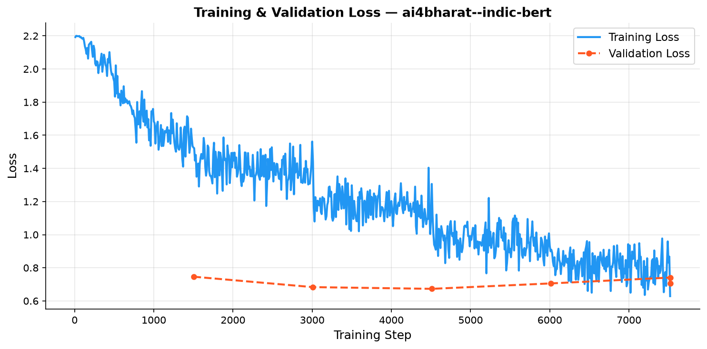
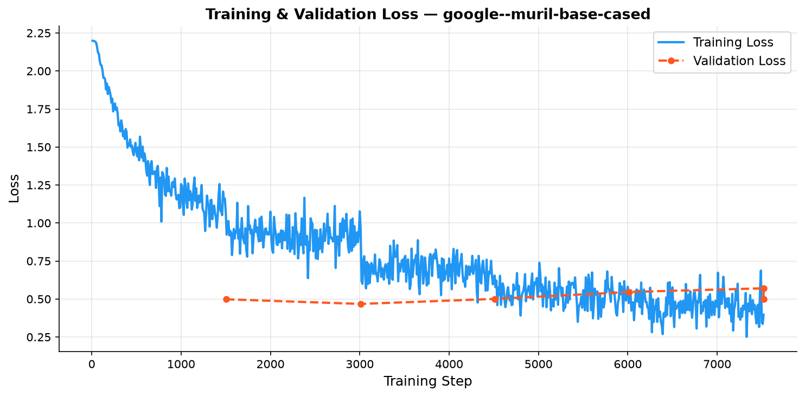

# Fine-tuning Small Language Models for Multilingual Sentiment Analysis
### Marathi / Code-mixed Text — Academic Mini-Project

---

## Project Overview

This project fine-tunes **small pre-trained language models** on the
[`l3cube-pune/marathi-sentiment-md`](https://huggingface.co/datasets/l3cube-pune/marathi-sentiment-md)
dataset for sentiment classification of Marathi and code-mixed text.

| Component | Detail |
|---|---|
| **Primary SLM** | `ai4bharat/indic-bert` |
| **Baseline SLM** | `google/muril-base-cased` |
| **Classical Baseline** | TF-IDF (char n-gram) + Logistic Regression |
| **Dataset** | `l3cube-pune/marathi-sentiment-md` (HuggingFace Hub) |
| **Target GPU** | NVIDIA RTX 5060 — 8 GB VRAM |


---

## 📊 Results

All models fine-tuned on the L3Cube-MahaSent-MD dataset (48,114 training samples, 3-class sentiment: Negative / Neutral / Positive).

### 1. Main Test Set Performance

| Model | Macro F1 | Precision | Recall | Accuracy | Latency |
|---|---|---|---|---|---|
| TF-IDF + Logistic Regression (Baseline) | 49.46% | 49.83% | 49.49% | — | — |
| 🔹 IndicBERT (`ai4bharat/indic-bert`) | 71.07% | 71.42% | 70.92% | 70.92% | 0.39 ms/sample |
| 🟣 **MuRIL (`google/muril-base-cased`)** | **81.20%** | **81.17%** | **81.28%** | **81.28%** | **0.42 ms/sample** |

> **MuRIL outperforms IndicBERT by +10.1% Macro F1**, demonstrating superior cross-lingual understanding of Marathi text.

---

### 2. Cross-Domain Generalisation (4 Domains)

| Domain | IndicBERT F1 | MuRIL F1 |
|---|---|---|
| Movie Reviews | 68.11% | **79.29%** |
| Generic Tweets | 67.02% | **77.94%** |
| TV Subtitles | 72.49% | **79.66%** |
| Political Tweets | 79.22% | **85.14%** |

---

### 3. Code-Mixed Evaluation (30 Romanized Marathi / Hindi-English Sentences)

| Model | Correct | Accuracy |
|---|---|---|
| 🔹 IndicBERT | 19 / 30 | 63.3% |
| 🟣 **MuRIL** | **24 / 30** | **80.0%** |

---

### 4. Training Loss Curves

| IndicBERT | MuRIL |
|---|---|
|  |  |

---

## Directory Structure

```
NLP/
├── app.py                 # Streamlit interactive web dashboard
├── requirements.txt
├── README.md
├── src/
│   ├── data_loader.py     # Dataset loading, normalization & tokenisation
│   ├── baseline.py        # TF-IDF + Logistic Regression baseline
│   ├── train.py           # Hugging Face Trainer fine-tuning
│   ├── evaluate.py        # Metrics + confusion matrix plots + latency
│   ├── domain_eval.py     # Cross-domain evaluation (4 L3Cube sub-datasets)
│   ├── predict.py         # Real-time CLI sentiment inference
│   └── code_mixed_eval.py # 30-sentence code-mixed test set evaluation
├── outputs/               # Saved model checkpoints (gitignored)
│   ├── ai4bharat--indic-bert/
│   └── google--muril-base-cased/
└── results/               # Metrics CSVs, confusion matrices, loss curves & plots
    ├── domain_eval/       # Per-domain CSVs, bar chart & latency chart
    └── code_mixed_eval/   # Code-mixed CSVs & confusion matrix
```

---

## Step 1 — Create and Activate a Virtual Environment

```bash
# Create venv inside the project folder
python -m venv venv

# Activate (Windows PowerShell)
.\venv\Scripts\Activate.ps1

# Activate (Windows CMD)
.\venv\Scripts\activate.bat

# Activate (Linux / macOS)
source venv/bin/activate
```

---

## Step 2 — Install CUDA-enabled PyTorch (RTX 5060 — CUDA 12.x)

> **Do this BEFORE installing requirements.txt** so pip does not
> override the CUDA build with a CPU-only version.

```bash
# PyTorch 2.4+ with CUDA 12.4 — compatible with RTX 5060 (Blackwell)
pip install torch torchvision torchaudio --index-url https://download.pytorch.org/whl/cu124
```

Verify the GPU is visible:

```bash
python -c "import torch; print('CUDA:', torch.cuda.is_available()); print('GPU:', torch.cuda.get_device_name(0))"
```

Expected output:
```
CUDA: True
GPU: NVIDIA GeForce RTX 5060
```

---

## Step 3 — Install the Remaining Dependencies

```bash
pip install -r requirements.txt
```

---

## Step 4 — Run the Pipeline

All scripts should be executed from the **project root** (`NLP/`) so that
relative paths (e.g. `results/`, `outputs/`) resolve correctly.

### 4a. Verify the Data Loader (optional sanity check)

```bash
# Full dataset preview
python src/data_loader.py

# Debug mode — only 100 rows per split
python src/data_loader.py --debug
```

---

### 4b. Run the Classical Baseline

```bash
# Debug mode (fast, ~5 seconds)
python src/baseline.py --debug

# Full dataset
python src/baseline.py
```

Outputs saved to `results/`:
- `baseline_metrics.csv`
- `baseline_confusion_matrix.txt`

---

### 4c. Fine-tune `indic-bert` ← **Primary Model**

#### ✅ Debug Mode (recommended first run — ~2 minutes on GPU)

```bash
python src/train.py --debug
```

This runs **1 epoch on 100 samples** to confirm the full pipeline
(GPU detection → tokenisation → training loop → checkpointing) works
before committing to the full run.

#### 🚀 Full Training Mode (~15–40 minutes on RTX 5060)

```bash
python src/train.py
```

Key hyperparameters tuned for 8 GB VRAM:

| Parameter | Value | Reasoning |
|---|---|---|
| `per_device_train_batch_size` | 16 | Safe for indic-bert on 8 GB VRAM |
| `gradient_accumulation_steps` | 2 | Effective batch = 32 |
| `fp16` | True | Halves memory — auto-enabled on CUDA |
| `num_train_epochs` | 5 | With early stopping (patience=2) |
| `learning_rate` | 2e-5 | Standard for BERT fine-tuning |

Checkpoints saved to `outputs/indic-bert-marathi-sentiment/`.

---

### 4d. Fine-tune `muril-base-cased` ← **Baseline SLM**

```bash
# Debug
python src/train.py --model google/muril-base-cased --debug

# Full
python src/train.py --model google/muril-base-cased
```

> Update `OUTPUT_DIR` in `train.py` or redirect the output to a
> separate directory by editing `output_dir` in `build_training_args`.

---

### 4e. Evaluate a Saved Model

```bash
# Evaluate indic-bert (debug mode — 100 eval samples)
python src/evaluate.py --debug

# Full evaluation
python src/evaluate.py

# Evaluate the MuRIL checkpoint
python src/evaluate.py --model_dir outputs/muril-marathi-sentiment
```

Outputs saved to `results/`:
- `indic-bert-marathi-sentiment_eval_summary.csv`
- `indic-bert-marathi-sentiment_per_class_metrics.csv`
- `indic-bert-marathi-sentiment_confusion_matrix.png` (raw + normalised side-by-side)

---

### 4f. Cross-Domain Evaluation ← **New**

Evaluates the fine-tuned model on each of the four original L3Cube
domain-specific test sets (downloaded automatically from HuggingFace Hub).

```bash
# Debug mode — 100 samples per domain (fast sanity-check)
python src/domain_eval.py --cpu --debug

# Full cross-domain evaluation on CPU
python src/domain_eval.py --cpu

# Full cross-domain evaluation with GPU
python src/domain_eval.py

# Evaluate a MuRIL checkpoint instead
python src/domain_eval.py --model_dir outputs/google--muril-base-cased --cpu
```

Outputs saved to `results/domain_eval/`:
- `<model>_domain_summary.csv`     — per-domain macro F1 / precision / recall
- `<model>_domain_comparison.png`  — grouped bar chart across all four domains
- `<model>_latency.png`            — inference latency (ms/sample) per domain

> **Requires internet access** on first run (HuggingFace Hub download).
> All four sub-datasets are **public** — no login or HF_TOKEN needed.

---

## VRAM Usage Guide (RTX 5060 — 8 GB)

| Stage | Estimated VRAM |
|---|---|
| Tokenisation (CPU) | ~0 GB |
| indic-bert inference (fp16, batch=32) | ~2.5 GB |
| indic-bert training (fp16, batch=16, grad_accum=2) | ~5–6 GB |
| MuRIL training (same config) | ~5–6 GB |

These estimates keep a comfortable buffer below the 8 GB limit.
If you encounter OOM errors, reduce `per_device_train_batch_size` to `8`.

---

## Reproducing Results Summary

```bash
# 1. Environment
python -m venv venv && .\venv\Scripts\Activate.ps1
pip install torch torchvision torchaudio --index-url https://download.pytorch.org/whl/cu124
pip install -r requirements.txt

# 2. Baseline
python src/baseline.py

# 3. Train indic-bert
python src/train.py

# 4. Train MuRIL
python src/train.py --model google/muril-base-cased

# 5. Evaluate both
python src/evaluate.py
python src/evaluate.py --model_dir outputs/muril-marathi-sentiment
```

---

## Troubleshooting

| Problem | Fix |
|---|---|
| `CUDA out of memory` | Reduce `per_device_train_batch_size` to `8` in `train.py` |
| `sentencepiece` import error | `pip install sentencepiece protobuf` |
| `evaluate` module not found | `pip install evaluate` |
| Model download slow | Set `HF_HUB_OFFLINE=1` after first download |
| `Activation.ps1 cannot be loaded` (PowerShell) | Run `Set-ExecutionPolicy RemoteSigned -Scope CurrentUser` |
