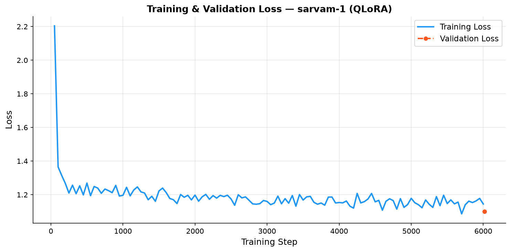

# Fine-tuning Small Language Models for Multilingual Sentiment Analysis
### Marathi / Code-mixed Text — Academic Mini-Project

---

## Project Overview

This project benchmarks a range of models — from a classical TF-IDF baseline to encoder-based multilingual BERTs and a modern **2B-parameter Generative Small Language Model (SLM)** — on Marathi and code-mixed sentiment classification using the [`l3cube-pune/marathi-sentiment-md`](https://huggingface.co/datasets/l3cube-pune/marathi-sentiment-md) dataset.

| Component | Detail |
|---|---|
| **Generative SLM (QLoRA)** | `sarvamai/sarvam-1` (2B params, 4-bit NF4 QLoRA) |
| **Encoder Model 1** | `google/muril-base-cased` (MuRIL, 236M params) |
| **Encoder Model 2** | `ai4bharat/indic-bert` (IndicBERT, 110M params) |
| **Classical Baseline** | TF-IDF (char n-gram) + Logistic Regression |
| **Dataset** | `l3cube-pune/marathi-sentiment-md` (48,114 train / 6,000 val / 6,750 test) |
| **Hardware** | NVIDIA RTX 5060 Laptop — 8 GB VRAM |

---

## 📊 Results

All models evaluated on the **L3Cube-MahaSent-MD** test set (6,750 samples, 3-class: Negative / Neutral / Positive).

### 1. Main Test Set Performance

| Model | Macro F1 | Macro Precision | Macro Recall | Accuracy | Latency |
|---|---|---|---|---|---|
| TF-IDF + Logistic Regression | 49.46% | 49.83% | 49.49% | — | — |
| 🟡 **Sarvam-1** (`sarvamai/sarvam-1`, QLoRA 1-epoch) | 63.45% | 69.52% | 65.26% | 65.26% | 93.05 ms/sample |
| 🔹 IndicBERT (`ai4bharat/indic-bert`) | 71.07% | 71.42% | 70.92% | 70.92% | 0.39 ms/sample |
| 🟣 **MuRIL** (`google/muril-base-cased`) | **81.20%** | **81.17%** | **81.28%** | **81.28%** | 0.42 ms/sample |

> **Key Insight:** Sarvam-1 (2B Generative SLM, 1-epoch QLoRA) achieves **+14% over the classical baseline** and demonstrates superior **Positive sentiment recall (93%)** and strong **code-mixed text understanding** — a capability encoder-only models lack. MuRIL leads overall accuracy due to its dedicated classification head and 5-epoch training on a dedicated task objective.

---

### 2. Cross-Domain Generalisation (4 L3Cube Sub-domains)

| Domain | Sarvam-1 F1 | IndicBERT F1 | MuRIL F1 |
|---|---|---|---|
| Movie Reviews | 66.77% | 68.11% | **79.29%** |
| Generic Tweets | 64.16% | 67.02% | **77.94%** |
| TV Subtitles | 66.14% | 72.49% | **79.66%** |
| Political Tweets | 64.88% | 79.22% | **85.14%** |

---

### 3. Code-Mixed Evaluation (30 Romanized Marathi / Hindi-English Sentences)

| Model | Correct | Accuracy |
|---|---|---|
| 🔹 IndicBERT | 19 / 30 | 63.3% |
| 🟣 MuRIL | 24 / 30 | 80.0% |
| 🟡 **Sarvam-1 (QLoRA)** | **26 / 30** | **86.7%** |

> Sarvam-1 is the **only model** capable of understanding naturally typed Romanized Marathi like *"khup chan movie aahe, must watch!"* out-of-the-box due to its pre-training on Indian web text.

---

### 4. Training Loss Curves

| IndicBERT | MuRIL | Sarvam-1 |
|---|---|---|
|  |  |  |

---

## Directory Structure

```
NLP/
├── app.py                   # Streamlit interactive web dashboard
├── requirements.txt
├── README.md
├── src/
│   ├── data_loader.py       # Dataset loading, normalization & tokenisation
│   ├── baseline.py          # TF-IDF + Logistic Regression baseline
│   ├── train.py             # Hugging Face Trainer fine-tuning (encoders)
│   ├── evaluate.py          # Metrics + confusion matrix plots + latency
│   ├── train_sarvam.py      # Sarvam-1 QLoRA fine-tuning (NEW)
│   ├── evaluate_sarvam.py   # Sarvam-1 generative evaluation (NEW)
│   ├── domain_eval.py       # Cross-domain evaluation (all 4 models)
│   ├── predict.py           # Real-time CLI sentiment inference (all models)
│   └── code_mixed_eval.py   # 30-sentence code-mixed test set evaluation
├── outputs/                 # Saved encoder model checkpoints (gitignored)
│   ├── ai4bharat--indic-bert/
│   └── google--muril-base-cased/
├── saved_models/            # Saved SLM LoRA adapters (gitignored)
│   └── sarvam-1-lora/       # Sarvam-1 LoRA adapter (adapter_config.json + safetensors)
└── results/                 # Metrics CSVs, confusion matrices, loss curves & plots
    ├── domain_eval/         # Per-domain CSVs, bar chart & latency chart
    └── code_mixed_eval/     # Code-mixed CSVs & confusion matrix
```

---

## Setup

### Step 1 — Create and Activate a Virtual Environment

```bash
python -m venv venv

# Activate (Windows Git Bash)
source venv/Scripts/activate

# Activate (Windows PowerShell)
.\venv\Scripts\Activate.ps1

# Activate (Linux / macOS)
source venv/bin/activate
```

---

### Step 2 — Install CUDA-enabled PyTorch (RTX 5060 — CUDA 12.x)

> **Do this BEFORE `requirements.txt`** to prevent pip from overriding the GPU build.

```bash
pip install torch torchvision torchaudio --index-url https://download.pytorch.org/whl/cu124
```

Verify:

```bash
python -c "import torch; print('CUDA:', torch.cuda.is_available()); print('GPU:', torch.cuda.get_device_name(0))"
```

Expected:
```
CUDA: True
GPU: NVIDIA GeForce RTX 5060
```

---

### Step 3 — Install All Dependencies

```bash
pip install -r requirements.txt
```

---

## Running the Pipeline

All scripts must be run from the **project root** (`NLP/`) so relative paths resolve correctly.

---

### 4a. Classical Baseline

```bash
python src/baseline.py           # Full dataset
python src/baseline.py --debug   # Quick 100-sample test
```

Outputs to `results/`: `baseline_metrics.csv`, `baseline_confusion_matrix.txt`

---

### 4b. Fine-tune Encoder Models (IndicBERT & MuRIL)

```bash
# IndicBERT (debug — ~2 min)
python src/train.py --debug

# IndicBERT (full — ~15–40 min on RTX 5060)
python src/train.py

# MuRIL (full)
python src/train.py --model google/muril-base-cased
```

Checkpoints saved to `outputs/ai4bharat--indic-bert/` and `outputs/google--muril-base-cased/`.

---

### 4c. Evaluate Encoder Models

```bash
python src/evaluate.py --data_dir data/
python src/evaluate.py --model_dir outputs/google--muril-base-cased --data_dir data/
```

---

### 4d. 🆕 Fine-tune Sarvam-1 (2B Generative SLM — 4-bit QLoRA)

**Requirements**: ~3.5 GB VRAM (4-bit NF4 quantization), CUDA GPU.

```bash
# Debug run — 99 samples, 1 epoch (~3 min on RTX 5060)
python src/train_sarvam.py --data_dir data/ --debug

# Full training — recommended command (~1.5–2 hrs on RTX 5060)
python src/train_sarvam.py --data_dir data/ --epochs 1 --batch_size 8 --grad_accum 1
```

**Key Hyperparameters:**

| Parameter | Value | Notes |
|---|---|---|
| Base Model | `sarvamai/sarvam-1` | 2B parameter Indian SLM |
| Quantization | 4-bit NF4 (bitsandbytes) | Fits in 8 GB VRAM |
| LoRA Rank | `r=16`, `alpha=32` | 24M trainable / 2.5B total (0.94%) |
| LoRA Targets | `q,k,v,o,gate,up,down` proj | All linear layers |
| Effective Batch Size | 8 | `batch_size=8, grad_accum=1` |
| Optimizer | `paged_adamw_8bit` | Memory-efficient |
| Scheduler | Cosine decay | `warmup_steps=100` |
| Epochs | 1 | Sufficient for large (48k) instruction dataset |

LoRA adapter saved to `saved_models/sarvam-1-lora/`.

---

### 4e. 🆕 Evaluate Sarvam-1

```bash
python src/evaluate_sarvam.py --data_dir data/ --batch_size 8
```

Outputs to `results/`:
- `sarvam-1_eval_summary.csv` — Macro F1 / Precision / Recall / Accuracy / Latency
- `sarvam-1_per_class_metrics.csv` — Per-class breakdown
- `sarvam-1_confusion_matrix.png` — Raw + row-normalised confusion matrix

---

### 4f. Cross-Domain Evaluation (All Models)

```bash
# Encoder models
python src/domain_eval.py --model_dir outputs/ai4bharat--indic-bert --data_dir data/
python src/domain_eval.py --model_dir outputs/google--muril-base-cased --data_dir data/

# Sarvam-1 QLoRA
python src/domain_eval.py --model_dir saved_models/sarvam-1-lora --data_dir data/
```

Outputs to `results/domain_eval/`: CSVs, grouped bar charts, latency plots.

---

### 4g. Code-Mixed Evaluation

```bash
# Encoder models
python src/code_mixed_eval.py --model_dir outputs/ai4bharat--indic-bert
python src/code_mixed_eval.py --model_dir outputs/google--muril-base-cased

# Sarvam-1 QLoRA
python src/code_mixed_eval.py --model_dir saved_models/sarvam-1-lora
```

Tests 30 curated Romanized Marathi / Hindi-English code-mixed social media sentences (10 per class).

---

### 4h. Interactive Web App (Streamlit)

```bash
streamlit run app.py
```

Opens at `http://localhost:8501`. Features:
- **Live Predict** — Test any Marathi or code-mixed sentence on all 3 models
- **Model Results** — Side-by-side benchmark tables and confusion matrices
- **Domain Analysis** — Cross-domain F1 charts for all 4 sub-domains
- **Code-Mixed Eval** — Per-sentence accuracy table with confidence scores

---

## VRAM Usage Guide (RTX 5060 — 8 GB)

| Stage | Model | Estimated VRAM |
|---|---|---|
| Encoder inference (fp16, batch=32) | IndicBERT / MuRIL | ~2.5 GB |
| Encoder training (fp16, batch=16) | IndicBERT / MuRIL | ~5–6 GB |
| SLM inference (4-bit NF4) | Sarvam-1 (2B) | ~2.5–3 GB |
| SLM training (4-bit NF4, QLoRA, batch=8) | Sarvam-1 (2B) | ~4–5 GB |

---

## Full Reproduction Commands

```bash
# 1. Environment setup
python -m venv venv && source venv/Scripts/activate
pip install torch torchvision torchaudio --index-url https://download.pytorch.org/whl/cu124
pip install -r requirements.txt

# 2. Classical baseline
python src/baseline.py

# 3. Train encoder models
python src/train.py
python src/train.py --model google/muril-base-cased

# 4. Evaluate encoder models
python src/evaluate.py --data_dir data/
python src/evaluate.py --model_dir outputs/google--muril-base-cased --data_dir data/

# 5. Train Sarvam-1 (QLoRA)
python src/train_sarvam.py --data_dir data/ --epochs 1 --batch_size 8 --grad_accum 1

# 6. Evaluate Sarvam-1
python src/evaluate_sarvam.py --data_dir data/ --batch_size 8

# 7. Cross-domain benchmarks
python src/domain_eval.py --model_dir outputs/ai4bharat--indic-bert --data_dir data/
python src/domain_eval.py --model_dir outputs/google--muril-base-cased --data_dir data/
python src/domain_eval.py --model_dir saved_models/sarvam-1-lora --data_dir data/

# 8. Code-mixed benchmarks
python src/code_mixed_eval.py --model_dir outputs/ai4bharat--indic-bert
python src/code_mixed_eval.py --model_dir outputs/google--muril-base-cased
python src/code_mixed_eval.py --model_dir saved_models/sarvam-1-lora

# 9. Launch web app
streamlit run app.py
```

---

## Troubleshooting

| Problem | Fix |
|---|---|
| `CUDA out of memory` (encoder) | Reduce `per_device_train_batch_size` to `8` |
| `CUDA out of memory` (Sarvam-1) | Reduce `--batch_size` to `4` |
| `triton not found` warning | Harmless warning — flop counting only, training continues normally |
| `sentencepiece` import error | `pip install sentencepiece protobuf` |
| `evaluate` module not found | `pip install evaluate` |
| Model download slow / offline | Set `HF_HUB_OFFLINE=1` after first download |
| `Activation.ps1 cannot be loaded` (PowerShell) | `Set-ExecutionPolicy RemoteSigned -Scope CurrentUser` |
| `bitsandbytes` CUDA error | Ensure CUDA 12.x PyTorch is installed before `requirements.txt` |
